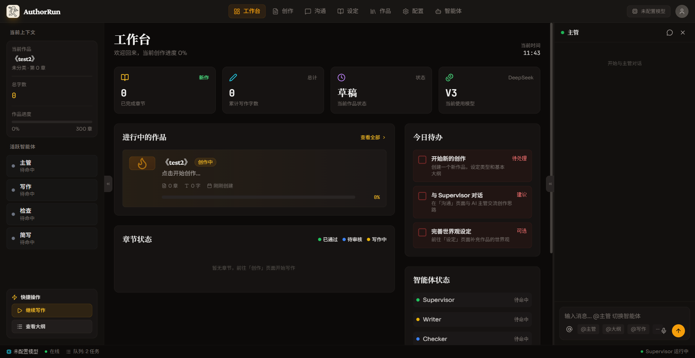

# AuthorRun — AI 辅助小说创作平台

  

  <strong>10 个 AI 智能体协作，完全本地运行，一次买断永久使用</strong>

---

## 特性

- 🤖 **10 个专用智能体** — 主管 / 大纲 / 写作 / 检查 / 简写 / 世界观 / 角色 / 伏笔 / 对话优化 / 插画师
- 🔒 **完全本地运行** — 作品数据不上传任何服务器，隐私零风险
- 🔑 **自带 API Key** — 直连 DeepSeek / Qwen / Kimi 等模型，不经中转
- 💰 **纯买断制** — ¥199 / ¥399 / ¥599，一次付费永久使用，无订阅
- 🖥️ **多平台** — Windows / macOS / Linux 桌面 + Android / iOS 移动端

---

## 截图

---

## 定价

| 版本 | 价格 | 内容 |
|------|------|------|
| **基础版** | ¥199 | 全部智能体 + 3 部作品 |
| **专业版** | ¥399 | 全部智能体 + 无限作品 + 导出 |
| **旗舰版** | ¥599 | 专业版全部 + 优先支持 + 未来功能 |

> 💡 一次购买，永久使用，无订阅陷阱。

---

## 常见问题

作品数据安全吗？

绝对安全。所有内容存储在您的本地磁盘上，通过 SQLite + ChromaDB 管理，不会上传任何内容到云端。您可以随时通过文件管理器查看原始数据。

需要自己提供 API Key 吗？

是的。AuthorRun 不提供任何 LLM API，您需要自己的 DeepSeek / Qwen / Kimi API Key。API 调用是您的客户端直连模型供应商，不经我们中转，费用由您直接支付给供应商。

支持哪些 AI 模型？

支持所有兼容 OpenAI API 格式的模型供应商。目前接入：
- DeepSeek (V3, R1)
- 通义千问 (Qwen)
- 月之暗面 (Kimi)
- 以及任何自定义 OpenAI-compatible API

源码是否公开？

源码目前不公开。本仓库用于文档、问题反馈和功能请求。AuthorRun 是专有商业软件，采用买断制付费。

---

## 反馈与建议

- 🐛 [报告 Bug](https://github.com/seoven/AuthorRun/issues/new?template=bug-report.md)
- 💡 [功能请求](https://github.com/seoven/AuthorRun/issues/new?template=feature-request.md)

---

## License

文档与素材采用 [CC BY-NC-ND 4.0](LICENSE)，软件本身为专有商业软件。

Copyright © 2026 AuthorRun
